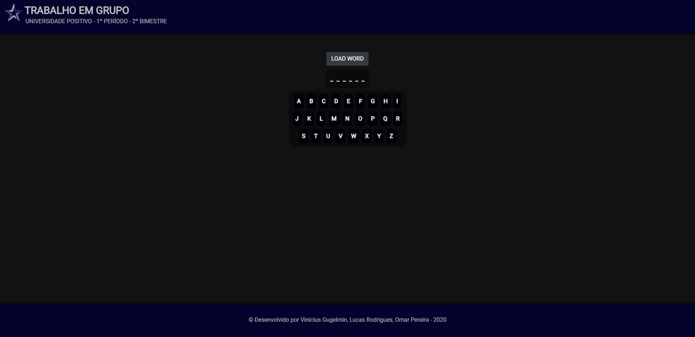
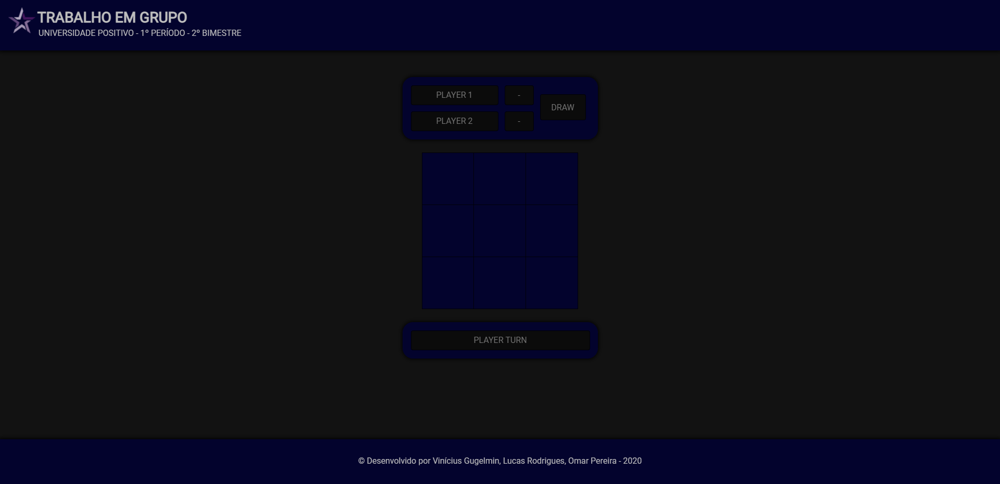

  

  <h3 align="center">game-page-up</h3>

  

    Game page
     
    <a href="https://github.com/viniciusgugelmin/game-page-up"><strong>Explore the docs »</strong></a>
     
     
    <!--
    <a href="https://github.com/viniciusgugelmin/game-page-up">View Demo</a>
    ·
    -->
    <a href="https://github.com/viniciusgugelmin/game-page-up/issues">Report Bug</a>
    ·
    <a href="https://github.com/viniciusgugelmin/game-page-up/issues">Request Feature</a>
  

  
<h2 style="display: inline-block">Abstract</h2>

  <ol>
    <li>
      <a href="#about-the-project">About The Project</a>
    </li>
    <li><a href="#roadmap">Roadmap</a></li>
    <li><a href="#contributing">Contributing</a></li>
    <li><a href="#contact">Contact</a></li>
  </ol>

## About The Project
Group work - Web Development
(2nd Bimester - Positivo University)

Games page: tic-tac-toe, hangman game. Contributing students: Vinícius Gugelmin, Lucas Rodrigues Leite, Omar Pereira Sedoski.

It was used simplification of components with the import of Vue.js and some classes of Bootstrap.

## Roadmap

See the [open issues](https://github.com/viniciusgugelmin/game-page-up/issues) for a list of proposed features (and known issues).

## Contributing

Any contributions you make are **greatly appreciated**.

1. Fork the Project
2. Create your Feature Branch (`git checkout -b feature/<featureName>`)
3. Commit your Changes (`git commit -m '<Description of the feature added>'`)
4. Push to the Branch (`git push origin feature/<featureName>`)
5. Open a Pull Request

## Contact

Vinícius Kruchelski Gugelmin - vinigugelmin@gmail.com

Project Link: [https://github.com/viniciusgugelmin/game-page-up](https://github.com/viniciusgugelmin/game-page-up)
